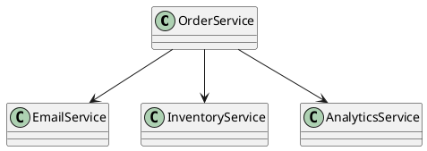
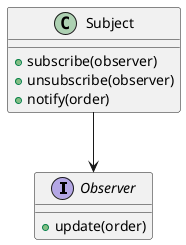
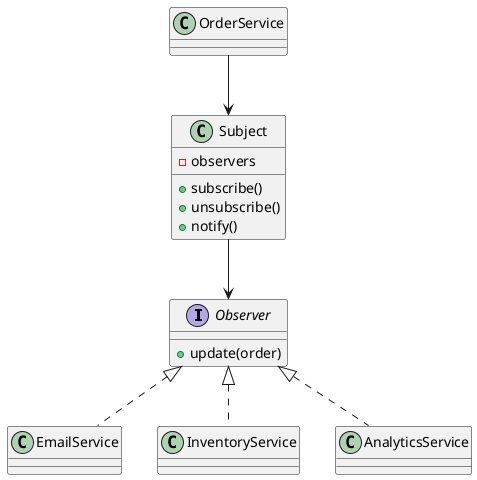

# Observer Pattern

## Why?

The Observer pattern solves the problem of notifying multiple interested objects when the state of another object changes, without tightly coupling them.

---

## Core Idea

A **Subject** maintains a list of **Observers**.

When its state changes, it notifies all registered observers.

```text
Subject
   │
   ├────────► Observer A
   ├────────► Observer B
   └────────► Observer C
```

---

## Participants

- **Subject (Publisher)**: Maintains subscribers and sends notifications.
- **Observer (Subscriber)**: Receives updates.
- **ConcreteObserver**: Performs a specific action when notified.

---

## Phase 4 - Naive Design

```python
class EmailService:
    def send_confirmation(self):
        print("Email sent")


class InventoryService:
    def update_stock(self):
        print("Inventory updated")


class AnalyticsService:
    def track_order(self):
        print("Analytics updated")


class OrderService:

    def __init__(self):
        self.email = EmailService()
        self.inventory = InventoryService()
        self.analytics = AnalyticsService()

    def place_order(self):
        print("Order placed")
        self.inventory.update_stock()
        self.email.send_confirmation()
        self.analytics.track_order()
```

### UML (PlantUML)



---

## Phase 7 - Introducing Observer

```python
from abc import ABC, abstractmethod

class Observer(ABC):
    @abstractmethod
    def update(self, order):
        pass


class Subject:
    def __init__(self):
        self._observers = []

    def subscribe(self, observer):
        self._observers.append(observer)

    def unsubscribe(self, observer):
        self._observers.remove(observer)

    def notify(self, order):
        for observer in self._observers:
            observer.update(order)
```

### UML (PlantUML)



---

## Phase 8 - Final Design

```python
class EmailService(Observer):
    def update(self, order):
        print(f"Email sent for {order}")


class InventoryService(Observer):
    def update(self, order):
        print(f"Inventory updated for {order}")


class AnalyticsService(Observer):
    def update(self, order):
        print(f"Analytics tracked for {order}")


class OrderService:
    def __init__(self, subject):
        self.subject = subject

    def place_order(self, order):
        print(f"Order {order} placed")
        self.subject.notify(order)


subject = Subject()
subject.subscribe(EmailService())
subject.subscribe(InventoryService())
subject.subscribe(AnalyticsService())

order_service = OrderService(subject)
order_service.place_order("ORD-101")
```

### UML (PlantUML)



---

## Design Principles

- SRP
- OCP
- DIP
- Low Coupling
- High Cohesion

---

## Trade-offs

### Advantages

- Loose coupling
- Easy extensibility
- Event-driven architecture
- Dynamic subscriptions

### Drawbacks

- Harder debugging
- Notification ordering
- Potential memory leaks
- Cascading events

---

## Real-world Examples

- Java Swing Event Listeners
- JavaScript DOM Events
- Django Signals
- Spring Application Events
- Node.js EventEmitter
- Kafka Consumers

---

## Strategy vs Factory vs Observer

| Pattern | Solves |
|----------|---------|
| Strategy | Change behavior |
| Factory Method | Change object creation |
| Observer | Notify interested parties |

---

## Common Mistakes

- Forgetting to unsubscribe.
- Creating circular notifications.
- Using Observer for one fixed dependency.
- Overloading observers with multiple responsibilities.

---

## Mental Model

> Newspaper Office → Subscribers

The publisher simply announces updates; subscribers decide how to react.

---

## Key Takeaways

- Subject knows **who** is subscribed, not **what** they do.
- Observers encapsulate reactions.
- New functionality is added by creating new observers.
- Observer is the basis of event-driven systems.
