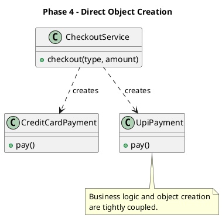
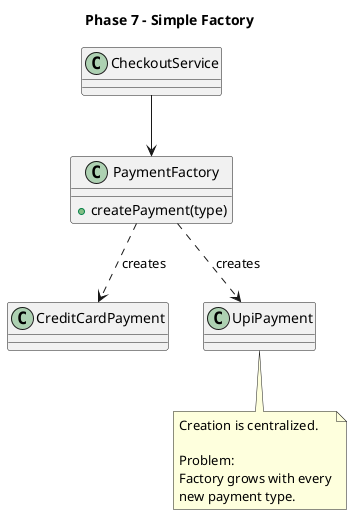
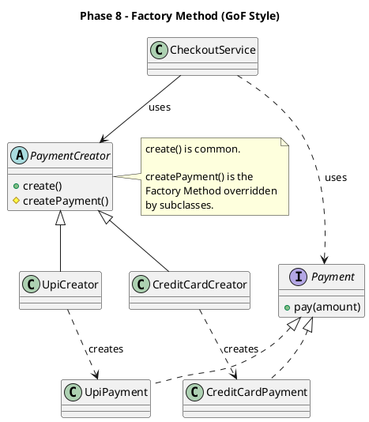

# Factory Method Pattern

## Intent

Delegate **object creation** to specialized creator classes so that the client depends on abstractions instead of concrete implementations.

> Factory Method is about **encapsulating object creation**, not simply hiding concrete classes.

---

# Why?

Suppose a client directly creates objects.

```python
payment = CreditCardPayment()
payment.pay(100)
```

Initially this is perfectly fine.

As new products are introduced:

- UPI
- PayPal
- Wallet
- Crypto

the creation logic starts spreading throughout the application.

Problems:

- Duplicate creation logic
- Tight coupling
- Difficult maintenance
- Constructor changes affect many places

---

# Naive Solution

```python
class CreditCardPayment:
    def pay(self, amount):
        print(f"Paid ₹{amount} using Credit Card")


class UpiPayment:
    def pay(self, amount):
        print(f"Paid ₹{amount} using UPI")


class CheckoutService:

    def checkout(self, payment_type, amount):

        if payment_type == "credit":
            payment = CreditCardPayment()

        elif payment_type == "upi":
            payment = UpiPayment()

        else:
            raise ValueError("Unsupported payment")

        payment.pay(amount)
```

Works well for small systems.



---

# Simple Factory

Move creation into one place.

```text
CheckoutService
      |
      v
PaymentFactory
      |
      +--> CreditCardPayment
      +--> UpiPayment
```

```python
class PaymentFactory:

    def create_payment(self, payment_type):

        if payment_type == "credit":
            return CreditCardPayment()

        elif payment_type == "upi":
            return UpiPayment()

        raise ValueError("Unsupported payment")

class CheckoutService:

    def __init__(self):
        self.factory = PaymentFactory()

    def checkout(self, payment_type, amount):

        payment = self.factory.create_payment(payment_type)

        payment.pay(amount)
```


Benefit:

- Client becomes cleaner.

Problem:

- Factory keeps growing.
- Every new product modifies the factory.




---

# Factory Method

Instead of one large factory, every product gets its own creator.

```text
CheckoutService
      |
      v
PaymentCreator
      |
      +--> CreditCardCreator
      +--> UpiCreator
```
```python
from abc import ABC, abstractmethod

class Payment(ABC):

    @abstractmethod
    def pay(self, amount):
        pass

class CreditCardPayment(Payment):
    def pay(self, amount):
        print(f"Paid ₹{amount} using Credit Card")


class UpiPayment(Payment):
    def pay(self, amount):
        print(f"Paid ₹{amount} using UPI")
```
```python
class PaymentCreator(ABC):

    @abstractmethod
    def create_payment(self):
        pass
class CreditCardCreator(PaymentCreator):

    def create_payment(self):
        return CreditCardPayment()


class UpiCreator(PaymentCreator):

    def create_payment(self):
        return UpiPayment()
class CheckoutService:

    def __init__(self, creator: PaymentCreator):
        self.creator = creator

    def checkout(self, amount):

        payment = self.creator.create_payment()

        payment.pay(amount)
```
```python
creator = UpiCreator()

checkout = CheckoutService(creator)

checkout.checkout(1000)
```python
```


Each creator knows how to create only one product.



---

# Important Learning

Factory Method **does NOT remove object creation**.

It moves the responsibility of creation to specialized creator classes.

The client no longer decides **how** to build an object.

---

# Biggest Insight

Factory Method is **NOT** mainly about Dependency Injection.

This is already enough:

```python
payment = PayPalPayment()
checkout = CheckoutService(payment)
```

This achieves:

- Dependency Inversion
- Loose Coupling
- Polymorphism

If object creation is simple, **this is often the preferred solution.**

Use Factory Method only when **object creation itself becomes complicated.**

Example:

```python
PayPalPayment(
    api_key,
    retry_policy,
    logger,
    timeout,
    telemetry,
    ...
)
```

---

# Don't Fear if-else

The goal is **not** to eliminate every if-else.

The goal is to ensure that a decision is made **once**, in a single place, instead of being scattered across the application.

One if during application startup is often better than many ifs throughout the codebase.

---

# Evolution of Complexity

```
Simple constructor
        ↓
Direct instantiation

        ↓
Creation logic grows

        ↓
Simple Factory

        ↓
Factory grows

        ↓
Factory Method

        ↓
Need to create multiple related objects

        ↓
Abstract Factory

        ↓
Entire object graph becomes large

        ↓
Dependency Injection Container
```

---

# Interface vs Abstract Class

Use an **Interface** when you only need a contract.

```python
interface Payment
```

Use an **Abstract Class** when subclasses should inherit common implementation.

```python
abstract class PaymentCreator

create()           <-- shared implementation

createPayment()    <-- subclasses override
```

In our simplified example both `Payment` and `PaymentCreator`
can be interfaces because neither contains shared implementation.

The original GoF pattern usually models the Creator as an abstract class.

---

# Advantages

- Loose coupling
- Open/Closed Principle
- Easier testing
- Encapsulated object creation
- Easier extension

---

# Disadvantages

- More classes
- Extra abstraction
- Can be overengineering for simple object creation

---

# Common Mistakes

❌ Creating factories for trivial constructors

❌ Thinking Factory Method is mandatory whenever polymorphism exists

❌ Believing Factory Method removes every if-else

❌ Using Factory Method when Dependency Injection alone is sufficient

---

# Mental Model

Customer doesn't cook.

Chef creates the food.

Customer only uses it.

Client doesn't build objects.

Creator builds objects.

Client only uses them.

---

# One-line Revision

Factory Method is useful **only when object creation itself becomes a responsibility worth encapsulating.**
